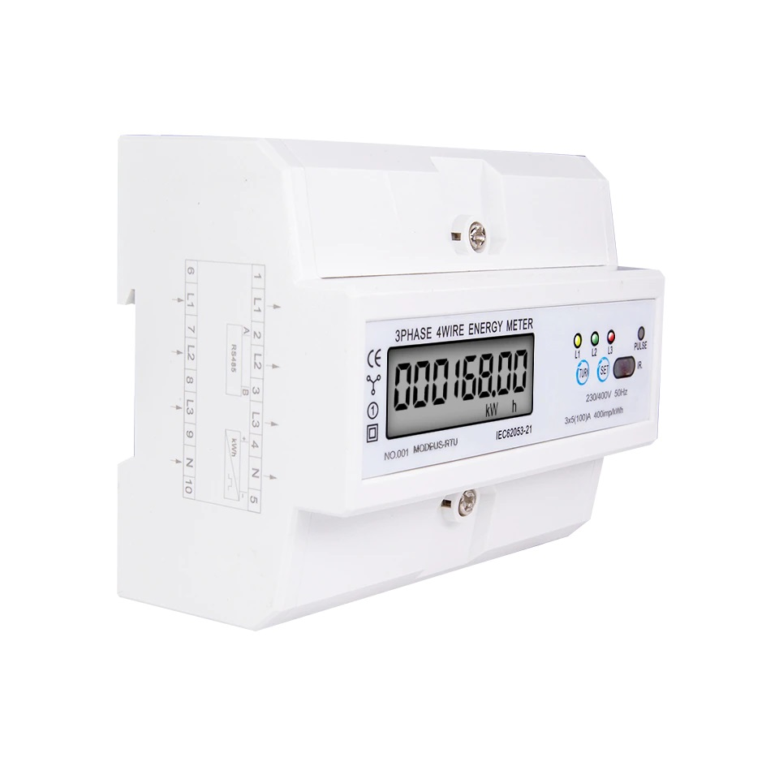

# DDS578R-to-MQTT
Readout DDS578R (or similar) via Modbus RS485 ans share via MQTT. 
The Libary minimalmodbus is used. 
Isolated CH340C USB Adapter is used. 
Care if your Device is ttyusb0 or other, check under /dev/ 

